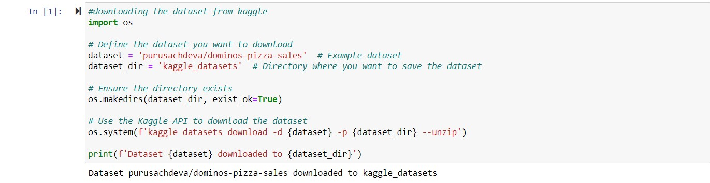
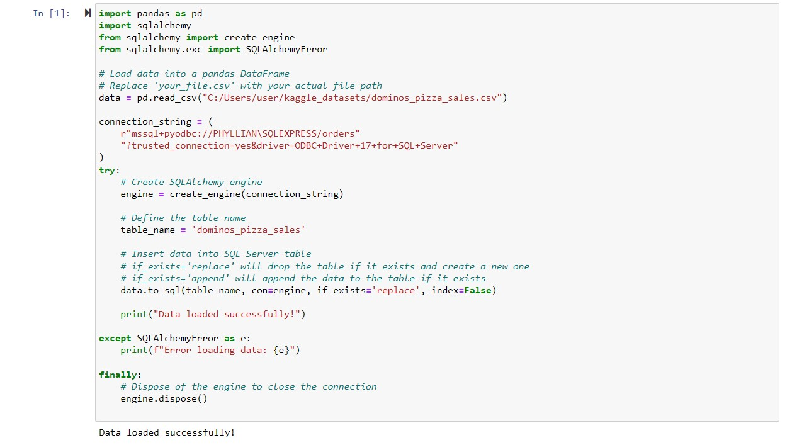
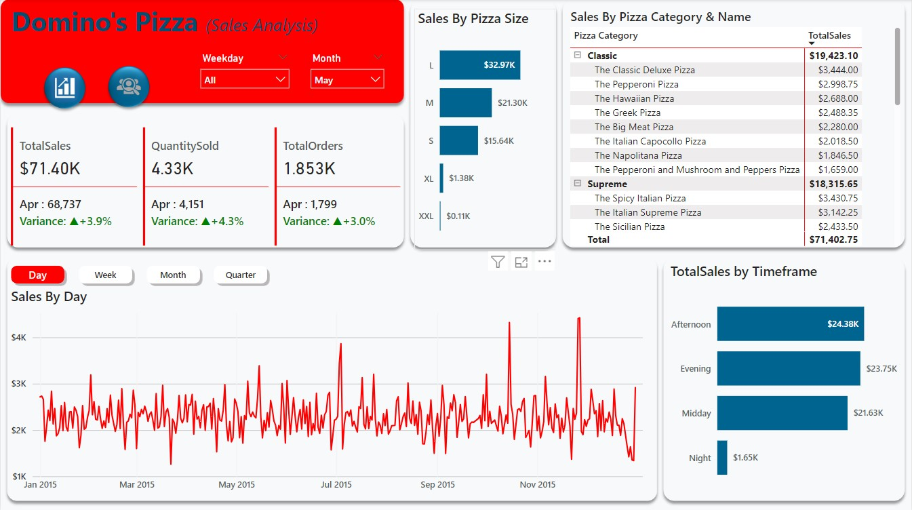
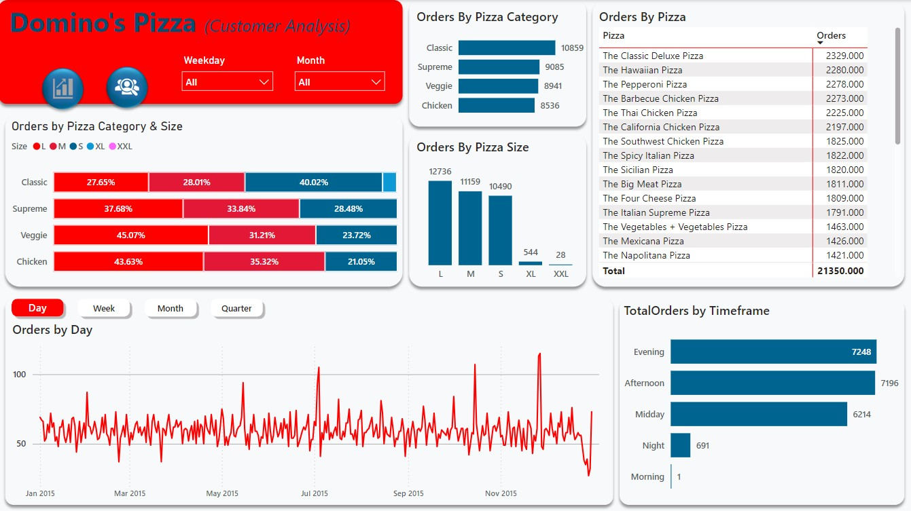

# Dominos-Sales-Analysis-Dashboard-Python-SQL-Power-BI
## Introduction
This is my data analytics project on **Domino's Pizza sales**. The dataset includes over 48,000 rows and 12 columns.
### Project Steps:
1. **Data Acquisition:** Downloaded the dataset using Python in Jupyter Notebook. Connected Python to MySQL server and loaded the dataset into the server.
 

2. **Data Cleaning and Transformation:** Cleaned and transformed the data using SQL in MySQL. Tasks included changing data types, checking for outliers, and removing null values and duplicates.

3. **Data Analysis and Visualization:** Connected MySQL to Power BI. Conducted data modeling, calculated KPIs with DAX formulas, and created an interactive dashboard.
---
## Data Visualizations:

### Dashboard 1: Sales Overview

1. **KPIs:** Total Sales, Quantity Sold, and Total Orders, with comparative analysis of previous vs. current month figures. Provides a snapshot of overall performance and monthly growth or decline.
2. **Line Graph:** Sales trend over time (daily, weekly, monthly, quarterly). Identifies sales peaks and troughs, helping to understand seasonal trends and daily sales patterns.
3. **Bar Chart:** Sales by timeframe (morning, midday, afternoon, evening, night). Highlights peak sales periods during the day, useful for staffing and promotional strategies.
4. **Table:** Sales by pizza category and pizza name. Shows which pizza categories and specific pizzas are top performers, guiding inventory and marketing focus.
5. **Bar Chart:** Sales by pizza size. Reveals the most popular pizza sizes, assisting in production planning and packaging decisions.
---

### Dashboard 2: Order Analysis

1. **Bar Graphs:** Number of orders by pizza category, size, and timeframe. Provides detailed order breakdown, showing preferences in categories and sizes, and peak order times.
2. **Line Graph:** Sales trends over time (daily, weekly, monthly, quarterly). Confirms trends seen in Dashboard 1 and helps correlate order volumes with sales revenue.
3. **Table:** Number of orders by pizza name. Pinpoints popular pizzas by order count, indicating customer favorites and potential best-sellers.
---
